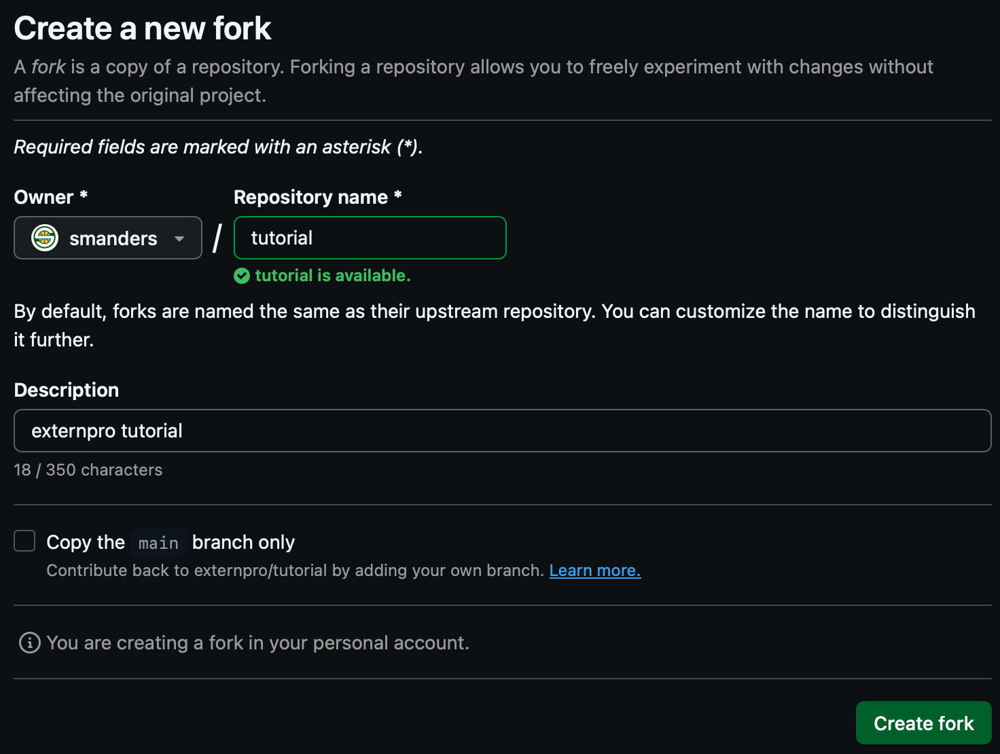
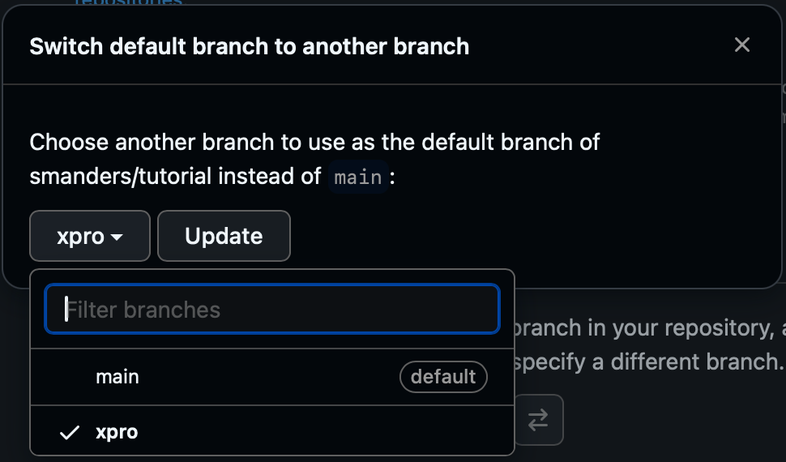
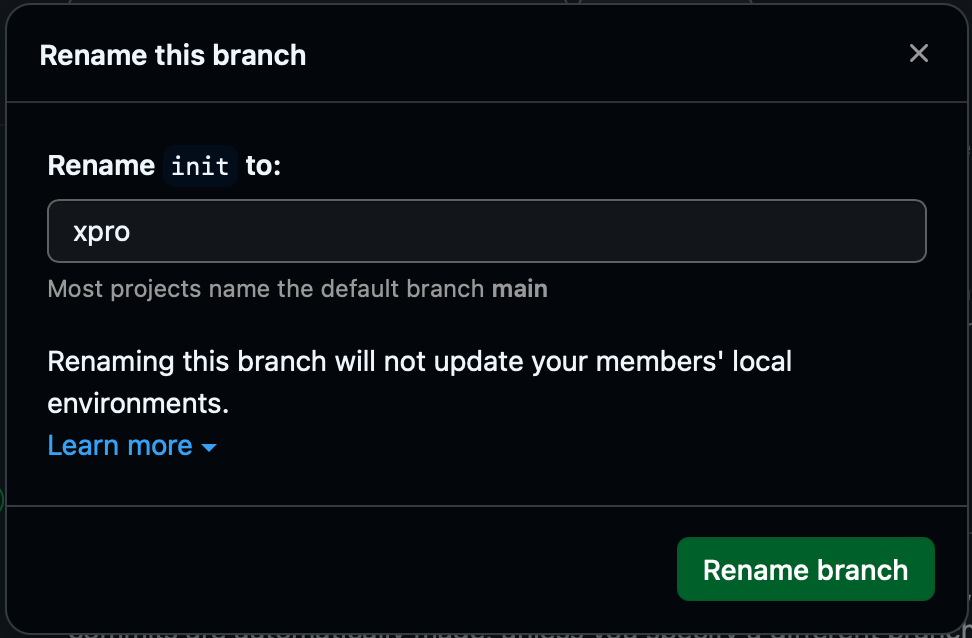
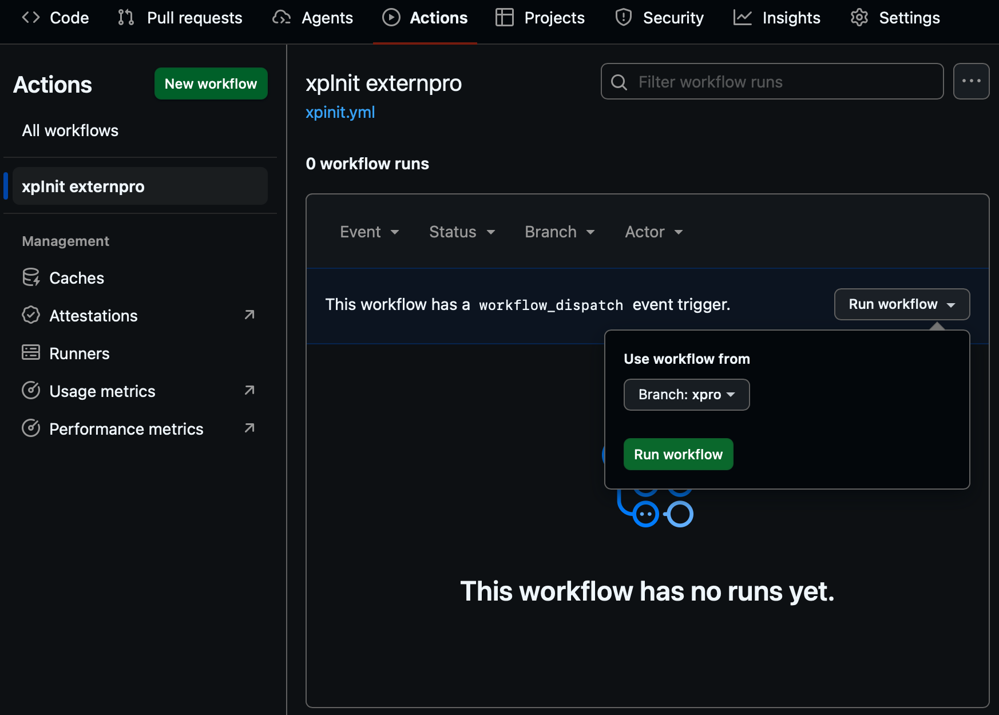

# tutorial
externpro tutorial

I came across this simple and straightforward video on YouTube
"C++ Package Management for Beginners: vcpkg and Conan Tutorial"
https://www.youtube.com/watch?v=8kiAklZGJJE

And I decided to create this tutorial repository that uses the same example CMakeLists.txt and main.cpp to show how simple, straightforward, and powerful externpro is to streamline your C++ projects.

1. fork https://github.com/externpro/tutorial into your github account/organization
   * optional: deselect "Copy the `main` branch only" checkbox so your clone includes the `v1.0` tag (if your forked repo doesn't have the tag, the steps below will fetch it from upstream and push it to your fork)

   
1. clone your fork to your local machine
   ```
   git clone https://github.com/your-username/tutorial
   ```
1. initialize externpro
   ```
   cd tutorial
   git remote add upstream https://github.com/externpro/tutorial
   git fetch --all # fetch all tags in case fork didn't include tags
   git checkout -b xpro v1.0
   git submodule add https://github.com/externpro/externpro .devcontainer
   git commit -m "add externpro as submodule" -m "git submodule add https://github.com/externpro/externpro .devcontainer"
   mkdir -p .github/workflows
   cp .devcontainer/.github/wf-templates/xpinit.yml .github/workflows/
   git add .github/workflows/xpinit.yml
   git commit -m "workflows: add xpinit" -m "cp .devcontainer/.github/wf-templates/xpinit.yml .github/workflows"
   git push origin xpro
   git push origin --tags # in case fork didn't include tags
   git fetch --all
   git branch --set-upstream-to=origin/xpro xpro
   ```
1. set xpro as default branch in github repo settings

   

   OR
   * if you wish to skip the above steps of cloning your fork to your local machine, initializing externpro, and setting `xpro` as default branch, you can make sure that when you fork the repo the 'Copy the `main` branch only' checkbox is deselected so that your fork also has the `init` branch and then:
     1. set `init` as the default branch

        
     2. rename the `init` branch to `xpro`

        
1. configure github secrets (PAT)

   Create a Personal Access Token (PAT) and add it as a repository secret so the `xpinit` workflow can access what it needs.

   Follow the instructions here:
   https://github.com/externpro/externpro/blob/main/.github/docs/secrets-and-tokens.md

1. run xpinit workflow

   
1. a pull request should be opened, which also launches a build on all platforms
1. add the optional `release:tag` label to the pull request to launch workflows that tag, build, and create a draft release once the pull request is merged
1. merge the pull request to proceed (if you've added the label, you can watch the workflows proceed on the Actions tab and then publish the draft release on the Releases tab)
1. a release can be used by a downstream project by adding the following to the downstream project's `CMakeLists.txt`:
   ```cmake
   set(xp_tutorial
     REPO github.com/<username-or-org>/tutorial
     TAG xpv1.0.1 # or <tag-from-release-notes>
     MANIFEST_SHA256 <SHA256-from-release-notes>
     )
   find_package(tutorial)
   ```
