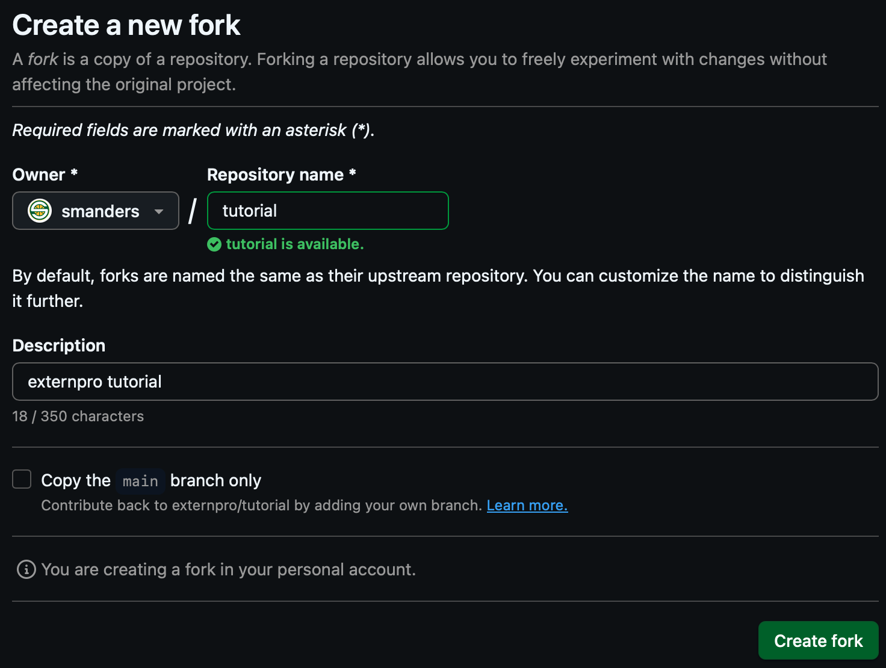
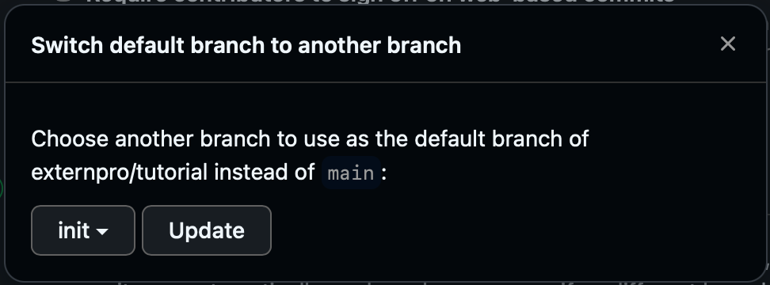
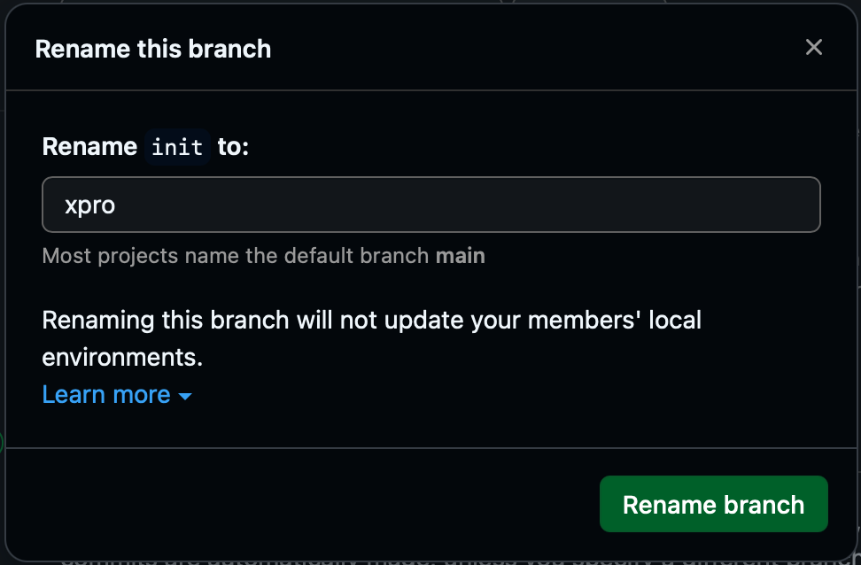
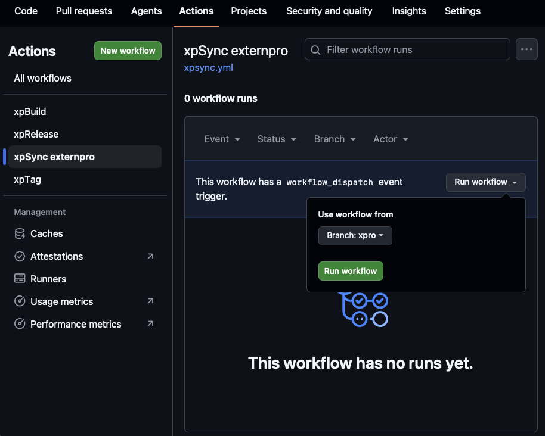

# externpro tutorial

There is an informative video on YouTube: "C++ Package Management for Beginners: vcpkg and Conan Tutorial" https://www.youtube.com/watch?v=8kiAklZGJJE

This repository uses the same example [`CMakeLists.txt`](CMakeLists.txt) and [`main.cpp`](main.cpp) to show how simple, straightforward, and powerful [externpro](https://github.com/externpro/externpro) is to streamline your C++ projects.

externpro is a CMake build platform and dependency provider with reusable CI (continuous integration) pipelines that enables you to build your own stack.

## Overview

This tutorial walks through adopting externpro in a project repo:
1. vendoring externpro as a `.devcontainer` submodule
1. running the bootstrap script to initialize the repository (CMakePresets, workflows, docker-compose links)
1. running `xpSync` to standardize presets + workflows + repo wiring
1. understanding the tag/build/release flow (`xpTag` -> `xpBuild` -> `xpRelease`)
1. consuming externpro-produced dependencies via CMake `find_package()`

What success looks like:
1. your repo has an `xpro` branch (typically the default branch)
1. your repo has the caller workflows needed to run `xpSync`
1. you can merge an `xpSync` pull request to adopt externpro's standard presets + workflows + repo wiring
1. you can build and publish release artifacts usable by downstream projects across multiple compilers, operating systems, and processor architectures

## Prerequisite

1. fork https://github.com/externpro/tutorial into your github account/organization
   * deselect "Copy the `main` branch only" checkbox:
     1. if you're going to start with the `init` branch (Path A)
     2. if you want your fork to include the `v1.1` tag (Path B can fetch the tag from upstream and push it to your fork)

   

## Choose your adoption path

### Path A: start with the `init` branch (GitHub-only)

This path avoids the local/manual initialization steps. You start from the `init` branch in GitHub and rename it to `xpro`.

Choose this path if you want the quickest on-ramp and prefer to do everything in GitHub.

NOTE: The `init` branch includes commits that:
- add externpro as the `.devcontainer` submodule (but likely at an older hash/tag)
- add the `xpSync` workflow

This means you may be starting with an older externpro template until you run `xpSync` (which will update the submodule to the HEAD of the `main` branch of externpro).

In the repository's "Settings > General" page:
1. set `init` as the default branch

   
1. rename the `init` branch to `xpro`

   

1. configure github secrets (PAT)

   Create a Personal Access Token (PAT) and add it as a repository secret so the `xpSync` workflow can access what it needs.

   NOTE: make sure GitHub Actions are enabled for your fork, and that you have permission to add repository secrets.

   Follow the instructions here:
   https://github.com/externpro/externpro/blob/main/.github/docs/secrets-and-tokens.md

### Path B: local/manual setup

In this path (if you follow the instructions below explicitly), the externpro submodule added will point at the HEAD of the `main` branch of externpro. This path requires that you have git installed and configured locally and that you have write access to your fork.

Choose this path if you want to understand (or customize) the wiring by applying it locally.

1. clone your fork to your local machine

   NOTE: use a clone URL/auth method that gives you write access to your fork so the `git push` commands in the bootstrap script will succeed.

   NOTE: run these commands from the directory where you want the `tutorial/` folder created.

   ```
   git clone https://github.com/your-username/tutorial
   ```

1. initialize externpro

   You can copy/paste this entire block into your terminal.

   ```
   cd tutorial
   git remote add upstream https://github.com/externpro/tutorial
   git fetch --all # fetch all tags in case fork didn't include tags
   git submodule add https://github.com/externpro/externpro .devcontainer
   ./.devcontainer/scripts/bootstrap.sh
   ```

   NOTE: You may need to run the bootstrap script multiple times until you see the messages including:
   ```
   [SUCCESS] Bootstrap script completed successfully!

   [INFO] Next steps:
   ```

1. verify the setup works locally

   ```
   cmake --list-presets
   cmake --preset=<platform>
   ```

   Commit and push any cmake configuration changes.

## Common steps (after Path A or Path B)

After completing either Path A or Path B, continue with the following steps:

1. preconditions before running `xpSync`

   By following the previous steps (regardless of whether you used Path A or Path B), the preconditions should already be met (externpro is vendored as the `.devcontainer` submodule, and you have an `xpro` branch plus the `xpSync` workflow). This link is included for completeness and to tie back to the authoritative documentation.

   https://github.com/externpro/externpro/blob/main/.github/docs/caller-workflows.md#preconditions-before-running-xpsync

1. run xpSync workflow

   - **Via Actions tab**: https://github.com/OWNER/REPO/actions/workflows/xpsync.yml
   - **Via CLI**: `gh workflow run xpsync.yml --ref xpro --repo OWNER/REPO`

   Replace `OWNER/REPO` with your actual repository (e.g., `your-username/tutorial`).

   

1. an `xpSync` pull request should be automatically opened, which also launches a build on all platforms
1. add the optional `release:tag` label to the `xpSync` pull request to launch workflows that tag, build, and create a draft release once the pull request is merged

   Use `release:tag` when you're ready to publish a versioned xpro package for downstream consumption.

1. merge the pull request to proceed (if you've added the label, you can watch the workflows proceed on the Actions tab and then publish the draft release on the Releases tab)

## What to expect after you merge the pull request

1. `xpBuild` runs on PRs targeting `xpro` (and on tag pushes, depending on template)
1. adding the `release:tag` label (then merging) triggers `xpTag`, which creates an `xpv*` tag
1. tag push triggers the tagged build; a successful tagged build triggers `xpRelease` to draft a GitHub Release

Release flow details:
https://github.com/externpro/externpro/blob/main/.github/docs/release-flow.md

## Using an "xpro package" in a downstream project

An xpro package is a release artifact plus its manifest metadata and generated CMake “use config”, so downstream repos can consume it via `find_package()`.

```cmake
set(xp_tutorial
  REPO github.com/<username-or-org>/tutorial
  TAG xpv1.0.1 # or <tag-from-release-notes>
  MANIFEST_HASH SHA256=<SHA256-from-release-notes>
  )
find_package(tutorial)
```

## Where to go next

### Repo wiring and workflows

- [Bootstrap script details](https://github.com/externpro/externpro/blob/main/.github/docs/bootstrap.md)
- [Caller workflows overview](https://github.com/externpro/externpro/blob/main/.github/docs/caller-workflows.md)
- [Adoption checklist](https://github.com/externpro/externpro/blob/main/cmake/docs/how-to-adopt-externpro.md)

### Consuming dependencies

- [Dependency provider](https://github.com/externpro/externpro/blob/main/cmake/docs/dependency-provider.md)
- [Download and extract](https://github.com/externpro/externpro/blob/main/cmake/docs/download-and-extract.md)

### Producing xpro packages

- [Extern package](https://github.com/externpro/externpro/blob/main/cmake/docs/extern-package.md)

### Packaging (MSI/RPM/etc)

- [Packaging](https://github.com/externpro/externpro/blob/main/cmake/docs/packaging.md)
